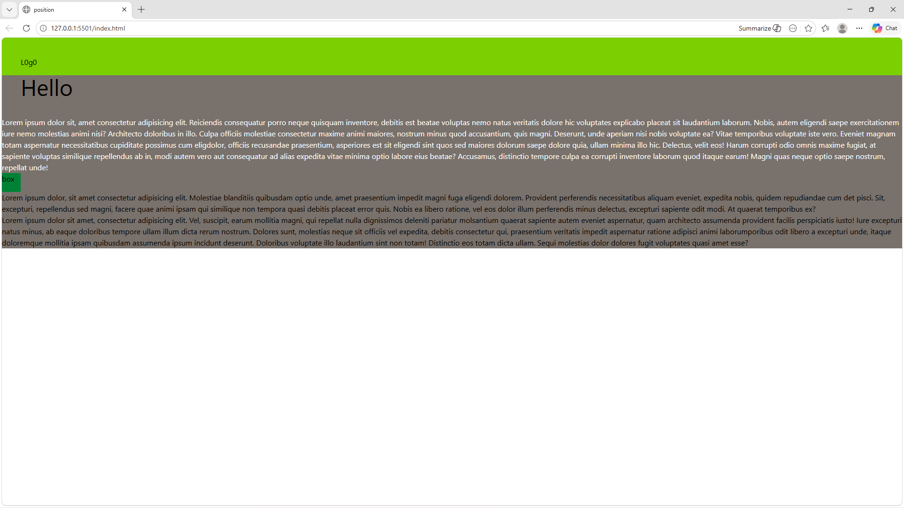

# tailwind css 

Here’s a clean and simple **README.md** file for your project:

---

# Tailwind CSS Position Demo

This project is a simple HTML page demonstrating the use of **CSS positioning** (`fixed`, `sticky`) using **Tailwind CSS**.


## 📌 Features

* Fixed navigation bar at the top
* Sticky positioned box element
* Responsive layout using Tailwind utility classes
* Basic typography and spacing

[live@]( https://jishnusmanoj2004-gif.github.io/box/)

    

## 🛠️ Technologies Used

* HTML5
* Tailwind CSS (via CDN)

## 📂 Project Structure

```
project-folder/
│── index.html
│── README.md
```

## 🚀 Getting Started

1. Clone or download this repository.
2. Open the `index.html` file in your browser.

No build tools or installation required since Tailwind is included via CDN.

## 💡 Code Overview

### Fixed Navbar

```html
<nav class="h-10 bg-lime-500 fixed w-full font-bold text-6xl p-10">
  L0g0
</nav>
```

* `fixed`: Keeps navbar at the top
* `w-full`: Full width
* `p-10`: Padding

---

### Sticky Element

```html
<div class="h-10 bg-green-700 w-10 sticky top-26">
  box
</div>
```

* `sticky`: Sticks when scrolling
* `top-26`: Offset from top

---

## ⚠️ Issues / Improvements

* Typo in class names:

  * `min-h- screen` → should be `min-h-screen`
  * `font-bold-text-6xl` → should be split into `font-bold text-6xl`
  * `fond bold` → should be `font-bold`

* Improve semantic structure and spacing

## 📸 Preview

Open the file in a browser to see:

* Fixed navbar staying at top
* Sticky box moving with scroll

